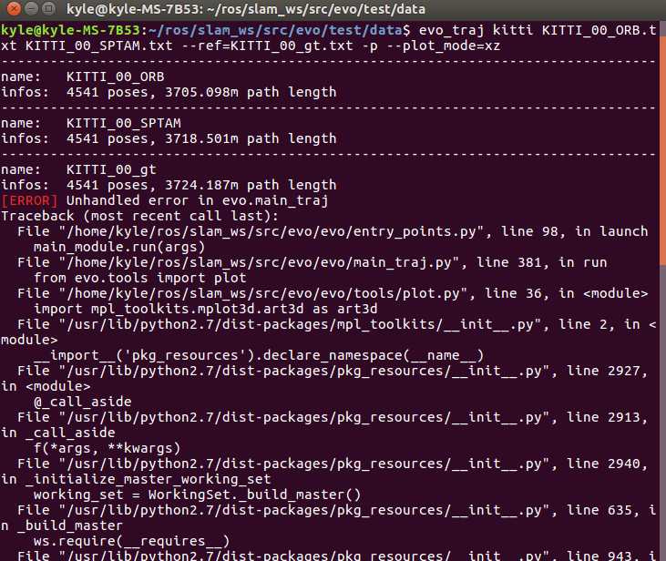

安装问题记录：

1. installation from PyPi (recommended):

   ```shell
   pip install evo --upgrade --no-binary evo
   ```

   (1) Error report:

   ```shell
   ImportError: No module named _internal.main
   ```

   Solution:

   ```shell
   sudo gedit /usr/local/bin/pip
   ```

   ```python
   #change:
   
   from pip import main
   #from pip._internal.main import main
   ```

2. installation from Source

   ```shell
   pip install --editable . --upgrade --no-binary evo
   ```

   (1) Error report:

   ```shell
   ImportError: No module named 'pip._internal.cli.main'
   ```

   Solution:

   ```shell
   sudo easy_install pip
   ```

   (2) Error report:

   

   Solution:

   ```shell
   sudo pip install --editable . --upgrade --no-binary evo
   ```

3. Plot multiple trajectories Error

   ```shell
   cd test/data
   evo_traj kitti KITTI_00_ORB.txt KITTI_00_SPTAM.txt --ref=KITTI_00_gt.txt -p --plot_mode=xz
   ```

   (1) Error report:

   

   Solution:

   ```shell
   pip install matplotlib --upgrade --user
   pip install numpy --upgrade --user
   ```

   

4. 